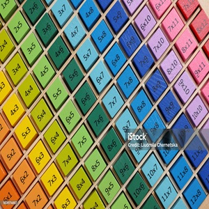

# Assignment 1 – Multiplication Table Generator

**Course:** COMP125 – Client-Side Web Development  
**Student:** Fatemeh Setareh  
**Date:** 2025

## Overview

This project generates a dynamic multiplication table based on user input for number of rows and columns. It uses:

- **HTML** for page structure
- **CSS** for styling
- **JavaScript** for DOM manipulation and logic

## Features

- Generates tables up to user-defined size
- Clean, responsive layout
- Includes an illustrative multiplication table image

## Files

- `assignment-1.html`: Main HTML structure
- `assignment1.js`: Script for generating the table
- `multiplication-table.jpg`: Visual reference for multiplication

## Screenshot

---

© 2025 Fatemeh Setareh. All rights reserved.
